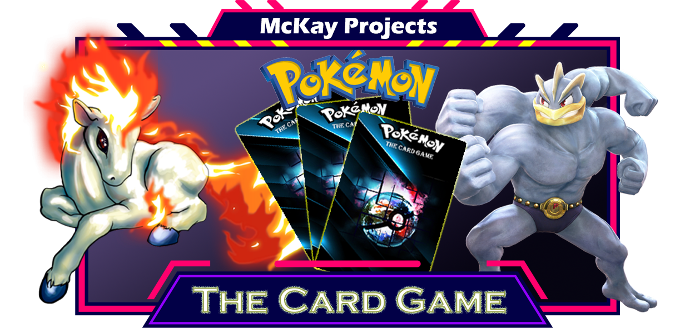

  
  <h1 align="center">Pokémon - The Card Game</h1>

A browser-based card game that you can play alone against AI or even online with other players.
An RPG game mode is also available, where you have the opportunity to explore a unique and exciting world. You can talk to different inhabitants of the world, take on tasks from them, face a lot of puzzles and adventures.
You can get to know the living world and collect valuable relics.

> ## Game Modes
> - Arena Game (Card Game)
> - Adventure Game

> ## Features

> |Feature                    |Game Mode             |In progress |Dev. Progress  | Version |
> |---------------------------|----------------------|------------|---------------|---------|
> |**Card Game**              |`Solo & Multiplayer`  |`yes`       |               |`0.0.1`  |
> |**Adventure Game**         |`Solo`                |`yes`       |               |`0.0.1`  |
> |**Match Statistics**       |`Solo & Multiplayer`  |`no`        |               |`--`     |
> |**Collecting Cards**       |`Solo`                |`yes`       |               |`--`     |
> |**Friend System**          |`--`                  |`no`        |               |`--`     |
> |**Message System**         |`--`                  |`no`        |               |`--`     |
> |**Leveling System**        |`Solo & Multiplayer`  |`no`        |               |`--`     |
> |**Collecting Coins**       |`Multiplayer`         |`no`        |               |`--`     |
> |**HUD & Inventory System** |`Multiplayer`         |`yes`       |               |`0.0.1`  |
> |**In-game Store System**   |`Solo & Multiplayer`  |`no`        |               |`--`     |
> |**Pokédex**                |`Solo`                |`yes`       |               |`0.0.1`  |
> |**Multi-Localization**     |`Solo & Multiplayer`  |`yes`       |               |`0.0.2`  |
> |**Music & Sound System**     |`Solo & Multiplayer`  |`yes`       |               |`0.0.1`  |

> ## Available Languages
> - English
> - Hungarian

> ## Requirements
> - Any Internet Browser
> - Minimum 1366x768 resolution
> 
> #### **IMPORTANT**
> This game is not mobile responsive!
> For the best gaming experience, we recommend a minimum resolution of **1366x768**.

---
> ### Game Developing by
> #### _McKay_